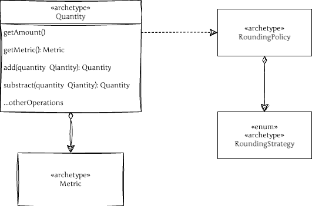
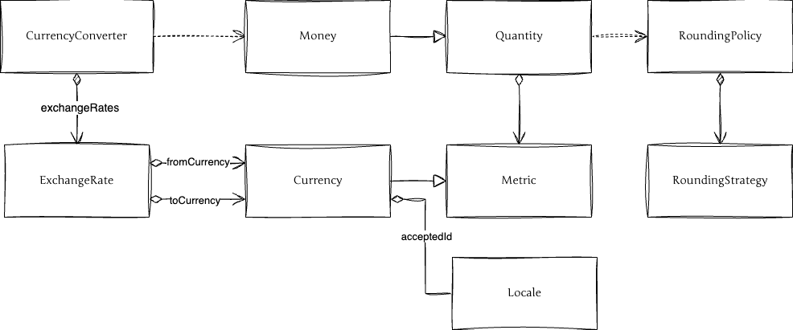

# software-archetypes-php
Some examples of software archetypes in PHP.

## Archetypes

### Quantity
`[EP], Chapter 10`, `[AP], Chapter 3.1`

### Money
`[EP], Chapter 11`, \
[)](docs/money.png)

### Price (in progress)
`[EP], Chapter 7.22`

### Rule
`[EP], Chapter 12`

---
#### Sources:
###### [EP] – [Jim Arlow and Ila Neustadt, "Enterprise Patterns and MDA: Building Better Software with Archetypes and Patterns", Addison-Wesley, 2004.](https://www.oreilly.com/library/view/enterprise-patterns-and/032111230X/)
###### [AP] – [Martin Fowler, "Analysis Patterns: Reusable Object Models", Addison-Wesley, 1997.](https://martinfowler.com/books/ap.html)

---
#### Worth to see:
- [Software Archetypes](https://www.enterprise-architecture.org/software-archetypes/)
- [Rule Archetype Pattern JAVA Example](https://github.com/commonality/archetypes-rules)